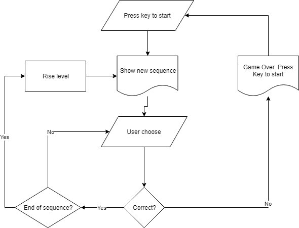
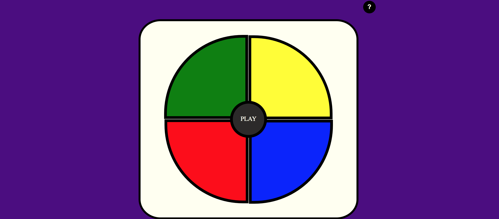

# Simon Game

Press the PLAY button. App will give the first signal. Repeat the signal by pressing the same
                    color of button

 If you choose it correcly, you will get the another signal. 

Continue playing as long as you can repeat each sequence of signals correctly.

# Tool & Technologies

### HTML, CSS, JavaScript, jQuery, flexbox
